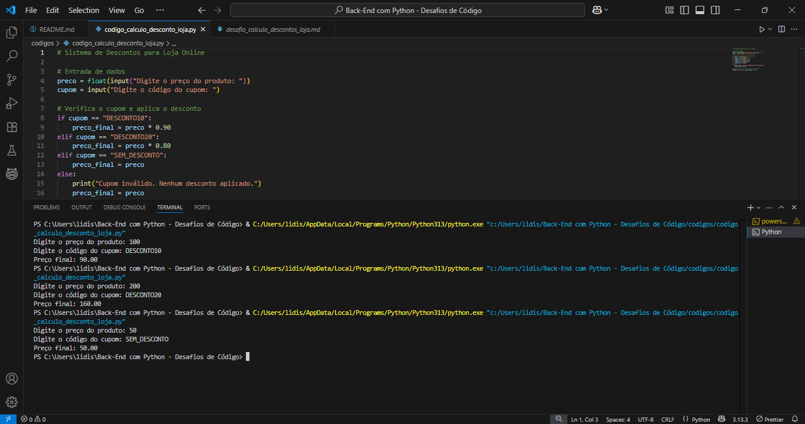
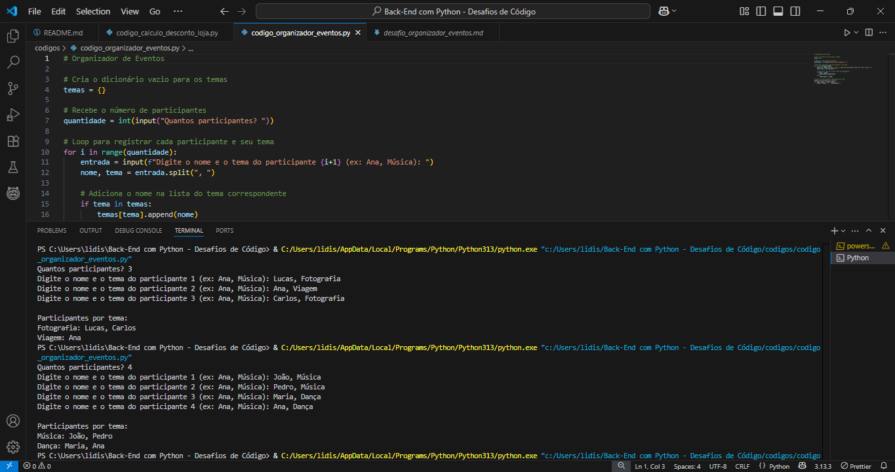
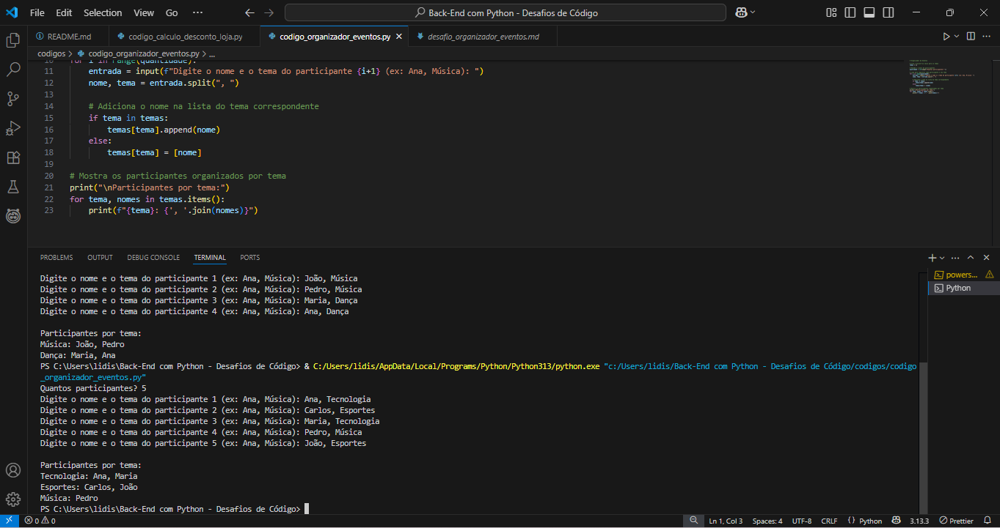
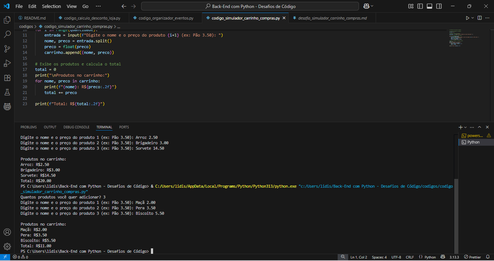
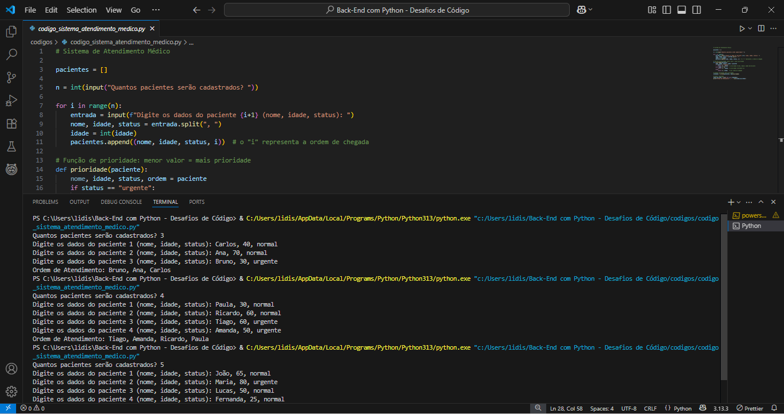
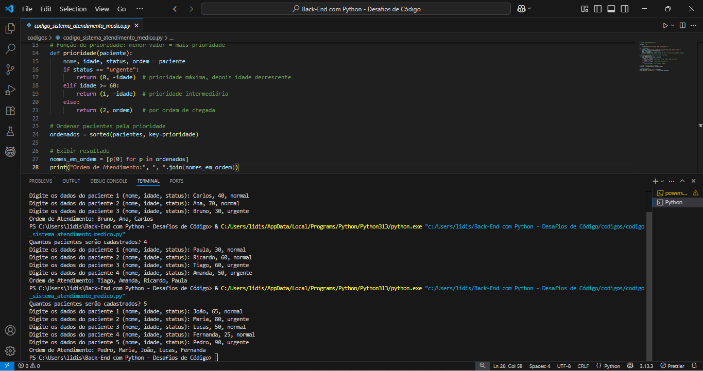
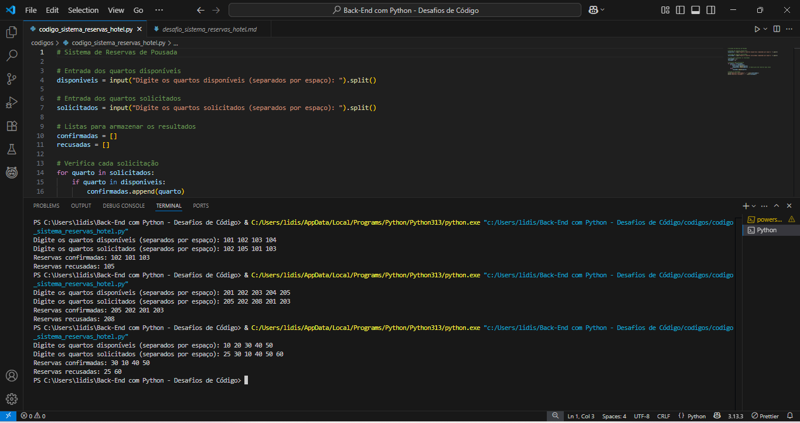
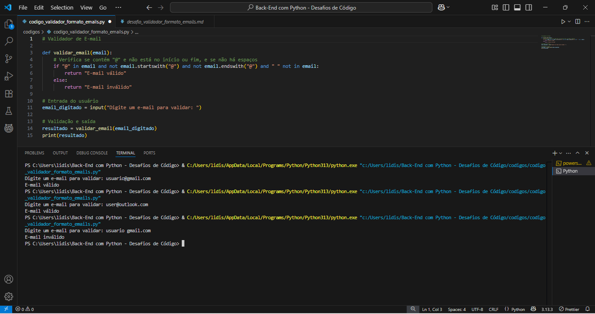

# 🐍 Desafios de Código - Bootcamp Back-End com Python

Este repositório reúne os desafios propostos durante o **Bootcamp Back-End com Python - Santander**, oferecido pela [DIO](https://www.dio.me/). Aqui estão soluções simples e objetivas para exercícios práticos, focados no desenvolvimento das habilidades de lógica e programação com Python.

> 💡 Cada desafio foi resolvido com foco no aprendizado e evolução da lógica de programação.  

---

## 📂 Estrutura

- `codigos/`: Scripts Python com as soluções dos desafios.
- `desafios/`: Enunciados dos desafios em formato Markdown.
- `imagens/`: Capturas e recursos visuais de apoio.
- `README.md`: Este arquivo de apresentação.

---

## 🚀 Desafios Incluídos

> ℹ️ **Dica:** Clique nos títulos abaixo para revelar os detalhes de cada desafio.

<details>
  <summary>💸 <strong>Cálculo de Descontos em Loja</strong></summary>
  Aplicação de cupom promocional e cálculo do valor final com base no preço original do produto.
</details>

<details>
  <summary>🎭 <strong>Organizador de Eventos</strong></summary>
  Agrupa participantes por tema em um dicionário — ótimo para praticar uso de listas e estruturas condicionais.
</details>

<details>
  <summary>🛒 <strong>Simulador de Carrinho de Compras</strong></summary>
  Adiciona produtos ao carrinho e calcula o total da compra. Simples e útil para praticar listas e `input()`!
</details>

<details>
  <summary>🏥 <strong>Sistema de Atendimento Médico</strong></summary>
  Organiza pacientes com base em critérios de urgência e idade. Uma introdução poderosa ao uso de `sorted()` e prioridades.
</details>

<details>
  <summary>🏨 <strong>Sistema de Reservas de Pousada</strong></summary>
  Verifica se os quartos solicitados estão disponíveis e decide quais reservas são aceitas.
</details>

<details>
  <summary>📧 <strong>Validação de E-mails</strong></summary>
  Verifica se um endereço de e-mail segue regras básicas de formato: presença do "@" e ausência de espaços.
</details>

> 🚧 *Este repositório está em desenvolvimento. Em breve, mais desafios serão adicionados!*

---

## ▶️ Como Executar

1. Clone este repositório:
   ```bash
   git clone https://github.com/seu-usuario/nome-do-repo.git
   ```

2. Acesse a pasta dos códigos:
   ```bash
   cd BACK-END COM PYTHON - DESAFIOS DE CÓDIGO/codigos
   ```

3. Execute o arquivo que quiser testar:
   ```bash
   python nome_do_arquivo.py
   ```

---

## 📚 Visão Geral dos Desafios

| Desafio                        | Enunciado (.md)                                                                        | Código (.py)                                                                      | Execução (print)                                                                                                                                             |
|--------------------------------|----------------------------------------------------------------------------------------|------------------------------------------------------------------------------------|--------------------------------------------------------------------------------------------------------------------------------------------------------------|
| 💸 Desconto em Loja            | [Enunciado - Desconto](./desafios/desconto_em_loja.md)                                | [Código - Desconto](./codigos/codigo_calculo_desconto_loja.py)                   | <a href="./imagens/desconto.png" target="_blank"></a>                                                        |
| 🎭 Organizador de Eventos      | [Enunciado - Eventos](./desafios/organizador_eventos.md)                              | [Código - Eventos](./codigos/codigo_organizador_eventos.py)                      | <a href="./imagens/eventos.png" target="_blank"></a><br><a href="./imagens/eventos1.png" target="_blank"></a>                                                          |
| 🛒 Carrinho de Compras         | [Enunciado - Carrinho](./desafios/carrinho_compras.md)                                 | [Código - Carrinho](./codigos/codigo_carrinho_compras.py)                         | <a href="./imagens/carrinho.png" target="_blank"></a><br><a href="./imagens/carrinho1.png" target="_blank"></a>                                                        |
| 🏥 Atendimento Médico          | [Enunciado - Atendimento](./desafios/atendimento_medico.md)                           | [Código - Atendimento](./codigos/codigo_atendimento_medico.py)                   | <a href="./imagens/atendimento.png" target="_blank"></a><br><a href="./imagens/atendimento1.png" target="_blank"></a>                                                  |
| 🏨 Reservas de Pousada         | [Enunciado - Reservas](./desafios/reservas_pousada.md)                                | [Código - Reservas](./codigos/codigo_reservas_pousada.py)                         | <a href="./imagens/reservas.png" target="_blank"></a>                                                        |
| 📧 Validação de E-mail         | [Enunciado - E-mail](./desafios/validacao_email.md)                                   | [Código - E-mail](./codigos/codigo_validacao_email.py)                            | <a href="./imagens/email.png" target="_blank"></a>                                                              |

📸 Clique nas miniaturas na coluna “Execução” para visualizar as imagens em tamanho original.

---

## ✨ Sobre

💡 Este projeto foi desenvolvido com muito aprendizado e prática durante o bootcamp oferecido pela DIO em parceria com o Santander.

🐍 É uma forma de consolidar os conhecimentos adquiridos e compartilhar com outros aprendizes da comunidade Python. 

📌 Sinta-se à vontade para explorar, testar e até contribuir com sugestões!
